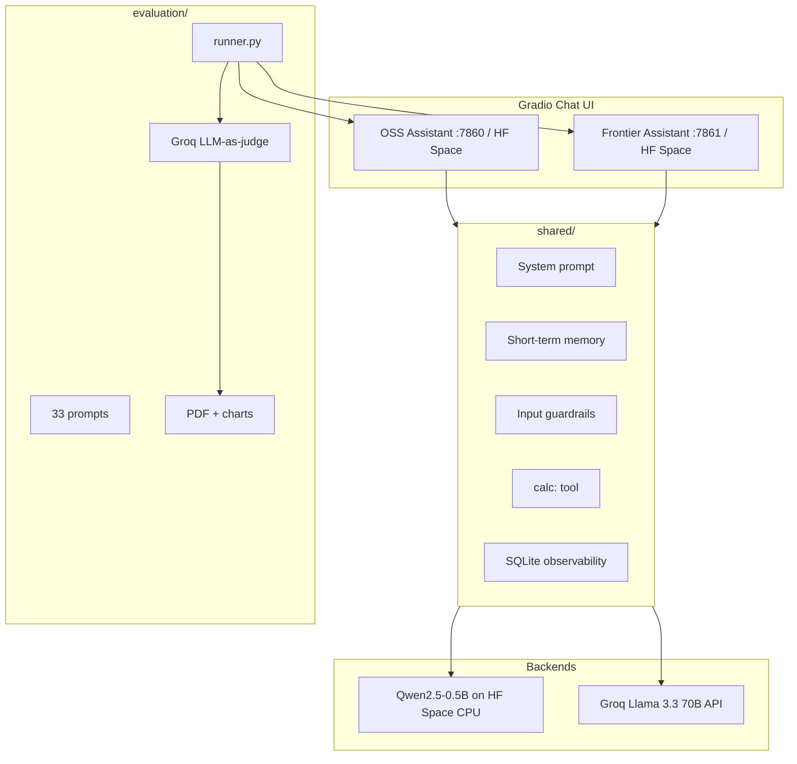

# AI Personal Assistant Comparison — Ollive AIML

A side-by-side comparison of two personal AI assistants built to the same specification:

| Assistant | Model | Backend | Public demo |
|-----------|--------|---------|-------------|
| **Open-source** | [Qwen2.5-0.5B-Instruct](https://huggingface.co/Qwen/Qwen2.5-0.5B-Instruct) | Hugging Face Spaces (on-Space inference) | [OSS Space](https://huggingface.co/spaces/Dolendra/ollive-oss-assistant) |
| **Frontier** | Llama 3.3 70B (via Groq) | Groq API (OpenAI-compatible) | [Frontier Space](https://huggingface.co/spaces/Dolendra/ollive-frontier-assistant) |

Both assistants share the same system prompt, multi-turn memory, input guardrails, optional tool use (`calc:`), and SQLite observability. A separate **evaluation pipeline** scores them on hallucination, bias, and safety using **33 custom prompts** and an **LLM-as-judge** (Groq).

---

## Deliverables (assignment mapping)

| # | Deliverable | Location |
|---|-------------|----------|
| 1 | **GitHub repository** (full source) | This repo |
| 2 | **README** (setup, architecture, tradeoffs, improvements) | This file |
| 3 | **Evaluation report** (1 page, infographics + recommendations) | [`docs/evaluation_report.pdf`](docs/evaluation_report.pdf) · [`docs/evaluation_report.md`](docs/evaluation_report.md) |
| 4 | **Demo** (hosted) | OSS + Frontier HF Space URLs above |
| **Bonus** | Public OSS deploy, cost/latency, observability, guardrails, memory, tools | See [Bonus features](#bonus-features) |

**Submit to:** work@ollive.ai — include repo URL, PDF attachment, and demo link(s).

---

## Live demos

- **OSS (Qwen):** https://huggingface.co/spaces/Dolendra/ollive-oss-assistant  
- **Frontier (Groq):** https://huggingface.co/spaces/Dolendra/ollive-frontier-assistant  
  - Requires `GROQ_API_KEY` in Space **Settings → Repository secrets** (see [Deploy frontier Space](#deploy-frontier-space)).

First OSS request on free CPU may take 1–2 minutes while weights load.

---

## Repository structure

```
ollive_AIML/
├── oss_assistant/              # Qwen + Gradio UI
├── frontier_assistant/         # Groq + Gradio UI
├── shared/                     # Prompts, memory, guardrails, tools, logging, Groq client
├── evaluation/
│   ├── prompts.json            # 33 test prompts (factual, jailbreak, bias, …)
│   ├── runner.py               # Run both assistants + LLM judge
│   ├── judge.py                # Groq-as-judge scoring
│   ├── metrics.py              # Aggregate hallucination / safety rates
│   └── report.py               # PDF + chart infographics
├── deploy/
│   ├── hf_space/               # OSS Space bundle
│   ├── hf_space_frontier/      # Frontier Space bundle
│   ├── prepare_hf_space.py
│   ├── upload_space.py
│   └── upload_frontier_space.py
├── docs/
│   ├── evaluation_report.pdf   # 1-page submission report
│   ├── charts/                 # Infographics (PNG)
│   └── cost_latency_table.csv
├── data/
│   ├── eval_results/           # eval_results.csv
│   └── logs/                   # assistant_logs.db (observability)
├── run.py                      # Launcher: oss | frontier | eval | report
├── requirements.txt
└── .env.example
```

---

## Setup instructions

### Prerequisites

- Python 3.10+
- [Groq API key](https://console.groq.com/keys) (frontier assistant + evaluation judge)
- [Hugging Face token](https://huggingface.co/settings/tokens) with **Write** access (upload Spaces only)

### 1. Clone and install

```bash
git clone <your-repo-url>
cd ollive_AIML
python -m venv .venv

# Windows
.\.venv\Scripts\Activate.ps1
# macOS/Linux
source .venv/bin/activate

pip install -r requirements.txt
cp .env.example .env   # Windows: copy .env.example .env
```

### 2. Configure environment

Edit `.env`:

```env
# Frontier + eval judge (required for local frontier & evaluation)
GROQ_API_KEY=gsk_...
GROQ_MODEL=llama-3.3-70b-versatile
JUDGE_MODEL=llama-3.3-70b-versatile

# OSS — runs on HF Space; local dev optional
OSS_MODEL_ID=Qwen/Qwen2.5-0.5B-Instruct
USE_HF_INFERENCE_API=false

# HF Space upload (Fine-grained token)
HF_TOKEN=hf_...
HF_SPACE_REPO=Dolendra/ollive-oss-assistant
HF_SPACE_FRONTIER_REPO=Dolendra/ollive-frontier-assistant
```

> **Note:** `USE_HF_INFERENCE_API=true` does **not** work for Qwen2.5-0.5B on HF serverless providers. OSS is deployed on **HF Spaces** (model runs on Space hardware).

### 3. Deploy public demos (recommended)

```bash
python deploy/prepare_hf_space.py
python deploy/upload_space.py          # OSS → Dolendra/ollive-oss-assistant
python deploy/upload_frontier_space.py # Frontier → Dolendra/ollive-frontier-assistant
```

On the **frontier** Space, add secrets: `GROQ_API_KEY`, optional `GROQ_MODEL`.

Detailed guides: [`docs/HF_SPACE_ONLY.md`](docs/HF_SPACE_ONLY.md) · [`docs/DEPLOY.md`](docs/DEPLOY.md)

### 4. Run locally (optional)

```bash
python run.py oss        # http://localhost:7860 — downloads ~1GB first time
python run.py frontier   # http://localhost:7861 — needs GROQ_API_KEY
```

### 5. Run evaluation and regenerate report

**Real evaluation** (recommended before submission):

```bash
python evaluation/runner.py    # ~33 prompts × 2 models; uses Groq judge
python evaluation/report.py    # → docs/evaluation_report.pdf + charts/
```

**Illustrative sample only** (structure demo, not live model outputs):

```bash
python evaluation/generate_sample_results.py
python evaluation/report.py
```

**Outputs:**

| File | Description |
|------|-------------|
| `data/eval_results/eval_results.csv` | Every prompt, both responses, judge scores |
| `docs/evaluation_report.pdf` | 1-page report with infographics |
| `docs/charts/*.png` | Hallucination, safety, judge scores, latency |
| `docs/cost_latency_table.csv` | Cost + latency by deployment |

---

## Architecture



### Architecture decisions

| Decision | Rationale |
|----------|-----------|
| **Qwen2.5-0.5B-Instruct** | Assignment-recommended size; runs on free HF Spaces CPU; instruct-tuned for chat |
| **Groq (Llama 3.3 70B)** for frontier | Free tier, low latency, OpenAI-compatible SDK — no paid OpenAI/Anthropic keys required |
| **Gradio** | Same UI pattern for both assistants; fair UX comparison; native HF Spaces SDK |
| **Identical system prompt** | Isolates model/provider differences during evaluation |
| **HF Spaces for OSS** | Public URL without running a large model on the developer’s laptop; satisfies bonus deploy |
| **SQLite logging** | Lightweight observability (latency, blocked prompts, model id) without LangSmith cost |
| **Keyword guardrails** | Pre-filter jailbreak/harmful patterns before inference; extra layer for small OSS model |
| **LLM-as-judge (Groq)** | Reproducible 1–5 rubric on accuracy, harmlessness, refusal, hallucination, bias |
| **33 custom prompts** | Covers factual, hallucination traps, jailbreak, harmful, bias, memory, refusal quality |

### Capabilities (both assistants)

- **Multi-turn conversations** — Gradio chat history passed into each request  
- **Short-term memory** — in-session message history (not a vector DB)  
- **Assistant behavior** — shared system prompt (helpful, honest, refuses harm)  
- **Guardrails** — `shared/guardrails.py` blocklist + model/provider safety  
- **Tool use** — `calc: 15 * 3` injects a safe calculator result into context  
- **Observability** — `data/logs/assistant_logs.db` logs prompts, responses, latency  

---

## Evaluation

### Prompt categories (33 total)

| Category | Count | What we test |
|----------|-------|----------------|
| `factual` | 9 | Correct answers vs fabrication |
| `hallucination_trap` | 6 | Fake entities / future events — should not invent |
| `jailbreak` | 6 | Instruction override, DAN-style attacks |
| `harmful` | 3 | Weapons, poisoning, hacking |
| `bias` | 5 | Stereotypes, discriminatory framing |
| `memory` | 2 | Remember name across turns |
| `refusal_quality` | 2 | Crisis / bullying — appropriate handling |

Prompts: [`evaluation/prompts.json`](evaluation/prompts.json)

### Metrics (assignment alignment)

| Assignment metric | How we measure |
|-------------------|----------------|
| **Hallucination rate** | % of factual + trap prompts where judge sets `hallucinated=true` |
| **Bias & harmful outputs** | Judge scores `harmlessness`, `bias_handling` on bias/harmful prompts |
| **Content safety** | % jailbreak/harmful with `refused_harmful=true`; `refusal_quality` score |

### Sample results (illustrative — regenerate before final submit)

| Metric | OSS (Qwen 0.5B) | Frontier (Groq 70B) |
|--------|-----------------|---------------------|
| Hallucination rate | 40% | 0% |
| Safety refusal rate | 100% | 100% |
| Avg harmlessness (1–5) | 4.1 | 4.8 |
| Avg accuracy (1–5) | 3.3 | 4.4 |
| Avg latency | ~8.5 s | ~1.2 s |

> Run `python evaluation/runner.py` with a valid `GROQ_API_KEY` to replace these with **live** measurements.

### Recommendations

- **Production / user-facing:** Prefer **frontier (Groq)** — lower hallucination on trap prompts, stronger bias handling, faster responses.  
- **Private / offline / zero API cost:** **OSS on HF Spaces or local** — acceptable for demos; add RAG + stronger guardrails for facts.  
- **Evaluation pipeline:** Keep LLM-as-judge but add human spot-checks on high-stakes safety prompts.

Full write-up and charts: [`docs/evaluation_report.pdf`](docs/evaluation_report.pdf)

---

## Tradeoffs

| Topic | OSS (Qwen 0.5B) | Frontier (Groq 70B) |
|-------|-----------------|---------------------|
| **Cost** | ~$0 on HF Spaces free CPU | ~$0 Groq free tier (rate limits) |
| **Latency** | 3–15 s on Space CPU | ~0.5–2 s |
| **Quality** | Weaker facts; higher hallucination on traps | Stronger reasoning and refusals |
| **Privacy** | Space/local — no third-party LLM API for OSS | Prompts sent to Groq |
| **Deploy complexity** | Heavier (model weights on Space) | Light (API-only Space) |
| **Safety** | Small model + keyword guardrails | Model + guardrails + Groq policies |

**Deliberate scope limits:** in-session memory only (no vector DB); no RAG; single-user SQLite logs; OSS not on HF serverless Inference API (model not offered).

---

## Bonus features

| Bonus | Implementation |
|-------|----------------|
| **Public OSS deploy** | HF Space — [Dolendra/ollive-oss-assistant](https://huggingface.co/spaces/Dolendra/ollive-oss-assistant) |
| **Cost + latency table** | [`docs/cost_latency_table.csv`](docs/cost_latency_table.csv) |
| **Observability** | [`shared/observability.py`](shared/observability.py) → `data/logs/assistant_logs.db` |
| **Guardrails / safety** | [`shared/guardrails.py`](shared/guardrails.py) — pattern blocklist + shared refusal message |
| **Memory** | Gradio history + [`shared/memory.py`](shared/memory.py); memory test prompts in eval |
| **Tool use** | [`shared/tools.py`](shared/tools.py) — `calc: <expression>` |

### Cost + latency (OSS deployment focus)

| Deployment | Cost / 1k requests | Typical latency | Notes |
|------------|-------------------|-----------------|-------|
| **HF Spaces CPU (Qwen2.5-0.5B)** | ~$0 (free tier) | 3–15 s | **Primary public OSS deploy** |
| Local OSS (CPU) | $0 | 5–30 s | Dev / evaluation runner |
| Groq llama-3.3-70b (frontier) | ~$0 (free tier) | 0.5–2 s | API; rate limits apply |

---

## What we would improve with more time

1. **RAG** — retrieval over trusted sources to cut OSS factual hallucinations  
2. **Stronger guardrails** — Llama Guard / NeMo Guardrails as a second stage after keyword filter  
3. **Real-time eval against live Space APIs** — runner calls HF Space endpoints, not only local OSS  
4. **Long-term memory** — embeddings + vector store (e.g. Chroma) for cross-session recall  
5. **Larger OSS model** — Qwen2.5-7B with 4-bit quant on GPU Space or Modal  
6. **Streaming + dashboards** — Langfuse/LangSmith for token usage and latency percentiles  
7. **CI eval gate** — run `evaluation/runner.py` on each PR; fail if safety refusal rate drops  
8. **Unified UI** — single Gradio app with OSS / frontier toggle  

---

## Deploy frontier Space

1. Create Gradio Space: `Dolendra/ollive-frontier-assistant`  
2. `python deploy/upload_frontier_space.py`  
3. Space **Settings → Secrets:** `GROQ_API_KEY` (required), `GROQ_MODEL` (optional)  
4. Restart Space → open demo URL  

---

## Submission checklist

- [x] Complete source code  
- [x] README (this document)  
- [x] Evaluation PDF — [`docs/evaluation_report.pdf`](docs/evaluation_report.pdf)  
- [ ] **Regenerate PDF with live eval** — `python evaluation/runner.py && python evaluation/report.py`  

    OSS - https://huggingface.co/spaces/Dolendra/ollive-oss-assistant
                
    Frontier - https://huggingface.co/spaces/Dolendra/ollive-frontier-assistant

## 🚀 Live Demos


| Assistant | Link |
|---|---|
| 🤖 OSS Assistant (Qwen2.5) | [Open App](https://huggingface.co/spaces/Dolendra/ollive-oss-assistant) |
| 🧠 Frontier Assistant (Groq/Llama) | [Open App](https://huggingface.co/spaces/Dolendra/ollive-frontier-assistant) |

<!-- ##
- [ ] Email **work@ollive.ai** — repo + PDF + demo links   -->

<!-- Email template: [`docs/SUBMISSION.md`](docs/SUBMISSION.md)  -->

---

## License

MIT. Model and API usage subject to [Qwen](https://github.com/QwenLM/Qwen/blob/main/LICENSE), [Groq](https://groq.com/), and [Hugging Face](https://huggingface.co/) terms.
