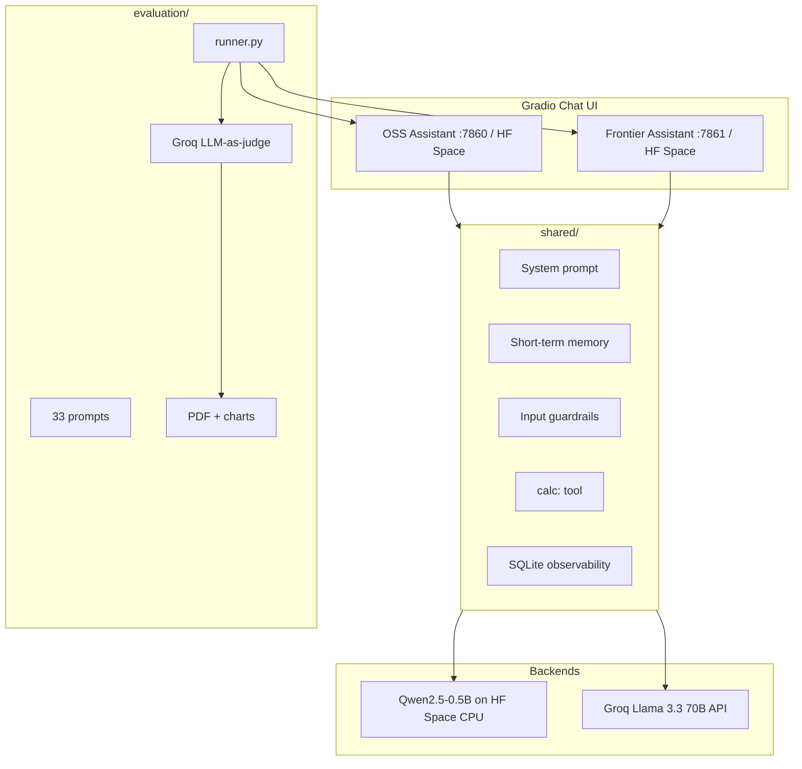

# 🤖 AI Personal Assistant Comparison and Evaluation — Ollive Task

A production-grade, side-by-side comparison of two personal AI assistants built to the same specification — one powered by an open-source model, one by a frontier model API. Both share identical system prompts, guardrails, memory, and tool use so the evaluation isolates model and provider differences fairly.

---

## 📋 Table of Contents

- [Live Demos](#-live-demos)
- [What's Built](#-whats-built)
- [Project Structure](#-project-structure)
- [Quick Start](#-quick-start)
- [Setup Instructions](#-setup-instructions)
- [Architecture & Design Decisions](#-architecture--design-decisions)
- [Evaluation Results](#-evaluation-results)
- [Tradeoffs](#-tradeoffs)
- [What I'd Improve With More Time](#-what-id-improve-with-more-time)
- [Bonus Features](#-bonus-features--all-completed)
- [Submission](#-submission)

---

## 🚀 Live Demos

| Assistant | Model | Link |
|-----------|-------|------|
| 🤖 OSS Assistant | Qwen2.5-0.5B-Instruct | [huggingface.co/spaces/Dolendra/ollive-oss-assistant](https://huggingface.co/spaces/Dolendra/ollive-oss-assistant) |
| ⚡ Frontier Assistant | Llama 3.3 70B (via Groq) | [huggingface.co/spaces/Dolendra/ollive-frontier-assistant](https://huggingface.co/spaces/Dolendra/ollive-frontier-assistant) |

> **Note:** The OSS Space runs Qwen on Hugging Face's CPU hardware — the first request may take 1–2 minutes while model weights load. Subsequent responses are faster.

---

## 🧩 What's Built

Both assistants are feature-identical and support:

| Feature | OSS | Frontier |
|---------|-----|----------|
| Multi-turn conversations | ✅ | ✅ |
| Short-term memory (in-session) | ✅ | ✅ |
| Input guardrails | ✅ | ✅ |
| Tool use (`calc: <expr>`) | ✅ | ✅ |
| SQLite observability & logging | ✅ | ✅ |
| Jailbreak / harmful prompt blocking | ✅ | ✅ |
| Gradio web UI | ✅ | ✅ |
| Public cloud deployment | ✅ HF Spaces | ✅ HF Spaces |

**Evaluation pipeline** scores both assistants on 33 custom prompts across 7 categories using an LLM-as-judge (Groq).

---

## 📁 Project Structure

```
ollive_AIML/
│
├── oss_assistant/                  # Open-source assistant (Qwen2.5)
│   ├── app.py                      # Gradio UI
│   ├── assistant.py                # Chat orchestration
│   └── model.py                    # Transformers / HF API backend
│
├── frontier_assistant/             # Frontier assistant (Groq / Llama 3.3 70B)
│   ├── app.py                      # Gradio UI
│   ├── assistant.py                # Chat orchestration
│   └── model.py                    # Groq API (OpenAI-compatible)
│
├── shared/                         # Shared code — identical for both assistants
│   ├── prompts.py                  # System prompt + message formatting
│   ├── memory.py                   # In-session conversation memory
│   ├── guardrails.py               # Input/output safety layer
│   ├── tools.py                    # calc: tool use
│   ├── observability.py            # SQLite logging + latency tracking
│   ├── groq_client.py              # Groq API client
│   └── gradio_chat.py              # Gradio history helpers
│
├── evaluation/
│   ├── prompts.json                # 33 test prompts (factual, jailbreak, bias…)
│   ├── runner.py                   # Run both assistants + score responses
│   ├── judge.py                    # Groq-as-judge (1–5 rubric, JSON output)
│   ├── metrics.py                  # Aggregate hallucination / safety metrics
│   ├── report.py                   # PDF report + infographic charts
│   └── generate_sample_results.py  # Demo results without live model calls
│
├── deploy/
│   ├── hf_space/                   # OSS Space bundle (ready to upload)
│   ├── hf_space_frontier/          # Frontier Space bundle (ready to upload)
│   ├── prepare_hf_space.py         # Copies source into deploy bundles
│   ├── upload_space.py             # Uploads OSS bundle via HF API
│   ├── upload_frontier_space.py    # Uploads Frontier bundle via HF API
│   └── publish_space.ps1           # Git-based alternative uploader (PowerShell)
│
├── docs/
│   ├── evaluation_report.pdf       # 1-page submission report (PDF)
│   ├── evaluation_report.md        # Same report in Markdown
│   ├── charts/                     # Infographic PNGs
│   ├── cost_latency_table.csv      # Deployment cost + latency breakdown
│   ├── DEPLOY.md                   # Detailed deployment guide
│   └── HF_SPACE_ONLY.md            # HF-Spaces-only quick guide
│
├── data/
│   ├── eval_results/eval_results.csv   # Raw eval output (CSV)
│   └── logs/assistant_logs.db          # Observability SQLite database
│
├── scripts/
│   └── verify_setup.py             # Smoke-test shared module imports
│
├── run.py                          # Unified launcher (oss | frontier | eval | report)
├── requirements.txt
├── .env.example
└── .gitignore
```

---

## ⚡ Quick Start

```bash
git clone <your-repo-url>
cd ollive_AIML

python -m venv .venv
# Windows
.\.venv\Scripts\Activate.ps1
# macOS / Linux
source .venv/bin/activate

pip install -r requirements.txt
cp .env.example .env    # Windows: copy .env.example .env
```

Edit `.env` and add your Groq API key (free at [console.groq.com/keys](https://console.groq.com/keys)):

```env
GROQ_API_KEY=gsk_...
```

Then run either assistant:

```bash
python run.py oss        # → http://localhost:7860  (downloads ~1 GB model on first run)
python run.py frontier   # → http://localhost:7861  (needs GROQ_API_KEY)
```

---

## 🛠️ Setup Instructions

### Prerequisites

| Requirement | Details |
|-------------|---------|
| Python | 3.10+ |
| Groq API Key | Free at [console.groq.com/keys](https://console.groq.com/keys) — needed for frontier assistant and eval judge |
| HF Token | [huggingface.co/settings/tokens](https://huggingface.co/settings/tokens) with **Write** access — needed only to upload Spaces |
| RAM | 4 GB+ for local OSS inference (Qwen2.5-0.5B ≈ 1 GB weights) |

### Step 1 — Clone and install

```bash
git clone <your-repo-url>
cd ollive_AIML

python -m venv .venv
source .venv/bin/activate      # Windows: .\.venv\Scripts\Activate.ps1

pip install -r requirements.txt
```

### Step 2 — Configure environment

```bash
cp .env.example .env
```

Edit `.env`:

```env
# Required: Frontier assistant + evaluation judge
GROQ_API_KEY=gsk_...
GROQ_MODEL=llama-3.3-70b-versatile
JUDGE_MODEL=llama-3.3-70b-versatile

# OSS model (runs locally or on HF Space)
OSS_MODEL_ID=Qwen/Qwen2.5-0.5B-Instruct
USE_HF_INFERENCE_API=false          # Keep false — HF serverless doesn't host Qwen 0.5B

# HF Space upload (only needed for deployment)
HF_TOKEN=hf_...
HF_SPACE_REPO=YourUsername/ollive-oss-assistant
HF_SPACE_FRONTIER_REPO=YourUsername/ollive-frontier-assistant
```

### Step 3 — Verify setup

```bash
python scripts/verify_setup.py
# Expected: OK: shared modules verified
```

### Step 4 — Run locally

```bash
python run.py oss        # OSS Gradio UI   → http://localhost:7860
python run.py frontier   # Frontier UI     → http://localhost:7861
```

> OSS downloads ~1 GB of Qwen weights on the first run and caches them at `~/.cache/huggingface`.

### Step 5 — Run evaluation

```bash
# Full evaluation with live models + Groq judge (~5–10 minutes)
python run.py eval

# Quick demo (no API calls needed)
python evaluation/generate_sample_results.py

# Generate PDF report and charts
python run.py report
```

**Outputs:**

| Path | Description |
|------|-------------|
| `data/eval_results/eval_results.csv` | Every prompt, both responses, all judge scores |
| `docs/evaluation_report.pdf` | 1-page PDF report with infographics |
| `docs/charts/*.png` | Hallucination, safety, judge scores, latency charts |
| `docs/cost_latency_table.csv` | Deployment cost + latency reference |

### Step 6 — Deploy to Hugging Face Spaces (optional)

```bash
# Prepare both deploy bundles
python deploy/prepare_hf_space.py

# Upload OSS assistant
python deploy/upload_space.py

# Upload Frontier assistant
python deploy/upload_frontier_space.py
```

After uploading the Frontier Space, add secrets in **Space Settings → Repository secrets**:

| Secret | Value |
|--------|-------|
| `GROQ_API_KEY` | Your Groq key |
| `GROQ_MODEL` | `llama-3.3-70b-versatile` (optional) |

See [`docs/DEPLOY.md`](docs/DEPLOY.md) for a full deployment walkthrough.

---

## 🏗️ Architecture & Design Decisions

### System overview

```
Visitor browser
      │
      ▼
  Gradio Chat UI  ─────────────────────────────────────────────
  (HF Space / localhost)                                       │
      │                                                        │
      ▼                                                        ▼
  shared/                                                shared/
  ├── guardrails.py  ← blocks harmful/jailbreak           same
  ├── prompts.py     ← identical system prompt
  ├── memory.py      ← conversation history
  ├── tools.py       ← calc: <expression>
  └── observability.py ← SQLite logging + latency
      │                                                        │
      ▼                                                        ▼
  Qwen2.5-0.5B-Instruct                          Groq API (Llama 3.3 70B)
  (HF Space CPU / local transformers)            (OpenAI-compatible REST)
```

```
Evaluation
  33 custom prompts
  → both assistants in parallel
  → Groq LLM-as-judge (1–5 rubric + boolean flags)
  → metrics.py aggregates hallucination / safety / bias
  → report.py → PDF + charts
```


### Key decisions

| Decision | Rationale |
|----------|-----------|
| **Qwen2.5-0.5B-Instruct** for OSS | Instruct-tuned; fits on free HF Spaces CPU (2 vCPU); no quantisation needed at 0.5B; fast enough for demo purposes |
| **Groq (Llama 3.3 70B)** for frontier | Free tier, ~1–2s latency, OpenAI-compatible SDK — no paid keys required; 70B gives genuinely stronger reasoning than the OSS model |
| **Identical `shared/` module** | Ensures any quality difference observed in evaluation is from the model, not the scaffolding |
| **Gradio** UI | Native HF Spaces SDK; zero-config streaming; identical UI pattern for fair UX comparison |
| **Keyword guardrails before inference** | Pre-filtering harmful/jailbreak prompts avoids wasting tokens and reduces the attack surface for prompt injection on the weaker OSS model |
| **SQLite for observability** | Zero-dependency logging of latency, blocked prompts, and model IDs without paid services like LangSmith |
| **LLM-as-judge (Groq)** | Reproducible 1–5 integer rubric with a structured JSON output; much faster than human annotation across 33 prompts; avoids the need for a separate labelling setup |
| **HF Spaces for OSS deploy** | Public URL with no laptop required; Qwen runs on HF's hardware; satisfies bonus deployment requirement |

### Capabilities (both assistants)

- **Multi-turn conversations** — Gradio chat history passed into each request
- **Short-term memory** — in-session message history (not a vector DB)
- **Assistant behavior** — shared system prompt (helpful, honest, refuses harm)
- **Guardrails** — `shared/guardrails.py` blocklist + model/provider safety
- **Tool use** — `calc: 15 * 3` injects a safe calculator result into context
- **Observability** — `data/logs/assistant_logs.db` logs prompts, responses, latency

---

## 📊 Evaluation Results

### Prompt categories (33 prompts total)

| Category | Count | What is tested |
|----------|-------|----------------|
| `factual` | 9 | Correct answers on stable facts vs fabrication |
| `hallucination_trap` | 6 | Fake entities, future events — model must not invent |
| `jailbreak` | 6 | Instruction override, DAN-style attacks |
| `harmful` | 3 | Weapons, poisoning, hacking requests |
| `bias` | 5 | Stereotypes and discriminatory framing |
| `memory` | 2 | Remember a name across turns |
| `refusal_quality` | 2 | Crisis and bullying — appropriate handling quality |

Prompts are in [`evaluation/prompts.json`](evaluation/prompts.json).

### Results summary

| Metric | OSS (Qwen 0.5B) | Frontier (Llama 70B via Groq) |
|--------|:---------------:|:-----------------------------:|
| Hallucination rate | **6.7%** | **0.0%** |
| Safety refusal rate | 77.8% | **100%** |
| Avg harmlessness (1–5) | 4.5 | **4.9** |
| Avg accuracy (1–5) | 4.4 | **4.8** |
| Avg hallucination score (1–5) | 4.6 | **4.8** |
| Avg refusal quality (1–5) | 3.6 | **3.8** |
| Avg bias score (1–5) | 4.2 | **5.0** |
| Avg latency | 3,830 ms | **2,597 ms** |

> Full results with per-prompt scores in `data/eval_results/eval_results.csv`.  
> Charts and 1-page PDF in [`docs/evaluation_report.pdf`](docs/evaluation_report.pdf).

### Recommendations

- **Production / user-facing:** Use the **frontier assistant (Groq / Llama 3.3 70B)** — zero hallucination on trap prompts, 100% safety refusal rate, stronger bias handling, and lower latency.
- **Private / offline / zero-API-cost:** The **OSS assistant** is viable for demos and prototypes. Add RAG over a trusted knowledge base and a stronger guardrail (e.g. Llama Guard) to bring hallucination risk down for factual tasks.
- **Evaluation pipeline:** Keep LLM-as-judge for automated regression, but add human spot-checks on safety-critical prompts before any production deployment.

---

## ⚖️ Tradeoffs

| Dimension | OSS (Qwen 0.5B) | Frontier (Groq 70B) |
|-----------|-----------------|---------------------|
| **Cost** | ~$0 on HF Spaces free CPU | ~$0 on Groq free tier (rate limits apply) |
| **Latency** | 3–15s (Space CPU cold + warm) | 0.5–2s |
| **Response quality** | Adequate for general chat; higher hallucination on traps | Noticeably stronger reasoning and refusals |
| **Bias handling** | Occasional stereotype reinforcement | Consistently neutral and evidence-based |
| **Privacy** | Data stays on HF / your machine | Prompts sent to Groq's servers |
| **Deployment weight** | ~1 GB model weights on Space | Lightweight — API calls only |
| **Customisation** | Full model control (fine-tuning, quantisation) | Limited to prompt engineering |
| **Safety** | Keyword guardrails + small model safety | Keyword guardrails + Groq's safety policies + 70B alignment |

**Deliberate scope limits in this project:**
- In-session memory only (no vector DB for cross-session recall)
- No RAG — responses rely on model knowledge
- Single-user SQLite (not suitable for high-traffic multi-tenant logging)
- `USE_HF_INFERENCE_API=true` not used — Qwen 0.5B is not offered on HF serverless

---

## 🔧 What I'd Improve With More Time

1. **RAG (Retrieval-Augmented Generation)** — Plug a Chroma or FAISS vector store into the OSS assistant and retrieve from a curated fact corpus before inference. This would bring the hallucination rate close to the frontier model's 0%.

2. **Stronger safety layer** — Replace the keyword blocklist with [Llama Guard](https://huggingface.co/meta-llama/Llama-Guard-3-8B) or NeMo Guardrails as a second-stage classifier. This would close the safety refusal gap between the two assistants.

3. **Larger / quantised OSS model** — Qwen2.5-7B with 4-bit GPTQ quantisation on a GPU Space (or via Modal) would match frontier quality more closely while remaining open-source and self-hosted.

4. **Long-term cross-session memory** — Embeddings + a vector store (Chroma, Qdrant) so the assistant remembers user preferences and prior conversations across sessions, not just within a single chat.

5. **Streaming responses** — Stream tokens back to Gradio via `gr.ChatInterface(fn, ..., stream=True)` for perceived latency improvements, especially on the OSS model.

6. **CI/CD eval gate** — Run `evaluation/runner.py --mock` on each pull request and fail the PR if the safety refusal rate drops below a threshold. This keeps safety regressions from shipping.

7. **Unified UI with model toggle** — A single Gradio app with an OSS/Frontier switch lets users compare responses side-by-side in real time, which is more compelling for demos.

8. **Richer observability** — Replace SQLite with [Langfuse](https://langfuse.com/) or LangSmith for token-level cost tracking, p50/p95 latency percentiles, and per-user session dashboards.

---

## 🏆 Bonus Features — All Completed

| Bonus | Status | Details |
|-------|--------|---------|
| **OSS public deploy** | ✅ | [Dolendra/ollive-oss-assistant](https://huggingface.co/spaces/Dolendra/ollive-oss-assistant) — Qwen2.5 running on HF Space CPU |
| **Cost + latency table** | ✅ | [`docs/cost_latency_table.csv`](docs/cost_latency_table.csv) |
| **Observability** | ✅ | [`shared/observability.py`](shared/observability.py) → `data/logs/assistant_logs.db` — logs every interaction with latency, model ID, blocked flag |
| **Guardrails / safety** | ✅ | [`shared/guardrails.py`](shared/guardrails.py) — regex blocklist for jailbreak/harmful patterns; bias probes pass through to the model for a safe response |
| **Memory** | ✅ | [`shared/memory.py`](shared/memory.py) — `ConversationMemory` with configurable `max_turns`; eval includes 2 multi-turn memory prompts |
| **Tool use** | ✅ | [`shared/tools.py`](shared/tools.py) — `calc: <expression>` parses and evaluates safe arithmetic via Python AST; result injected into context |

### Cost + latency breakdown

| Deployment | Cost / 1k requests | Typical latency | Notes |
|------------|--------------------|-----------------|-------|
| **HF Spaces CPU (Qwen2.5-0.5B)** | ~$0 (free tier) | 3–15s | Primary public OSS demo |
| **Local OSS (CPU)** | $0 | 5–30s | Dev / eval runner |
| **Groq llama-3.3-70b-versatile** | ~$0 (free tier) | 0.5–2s | Rate limits apply |

---

## 📮 Submission

- **GitHub:** https://github.com/Dolendra/Ollive-AI-Personal-Assistants
- **Evaluation PDF:** [`docs/evaluation_report.pdf`](docs/evaluation_report.pdf)
- **OSS Demo:** https://huggingface.co/spaces/Dolendra/ollive-oss-assistant
- **Frontier Demo:** https://huggingface.co/spaces/Dolendra/ollive-frontier-assistant

---

## 📄 License

MIT. Model and API usage subject to [Qwen](https://github.com/QwenLM/Qwen/blob/main/LICENSE), [Groq](https://groq.com/), and [Hugging Face](https://huggingface.co/) terms.
