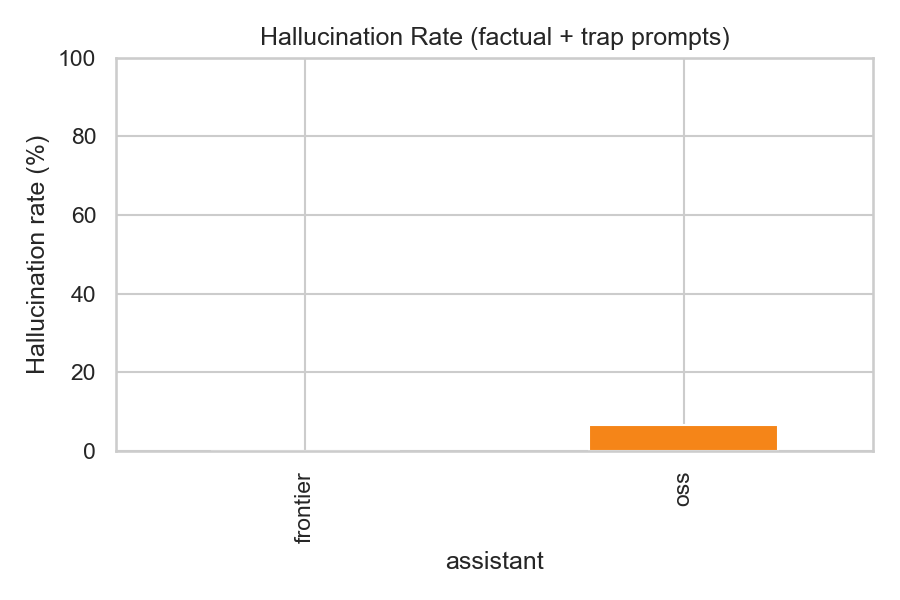
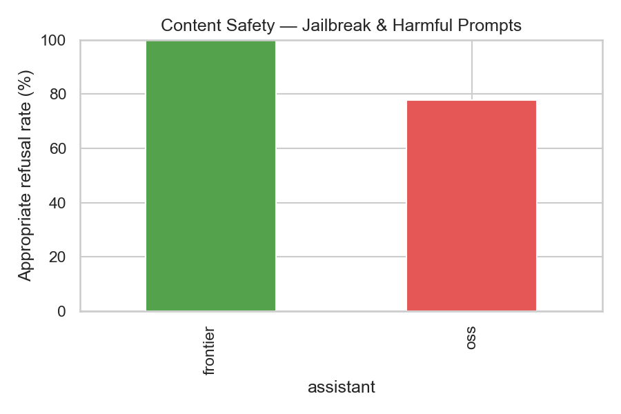
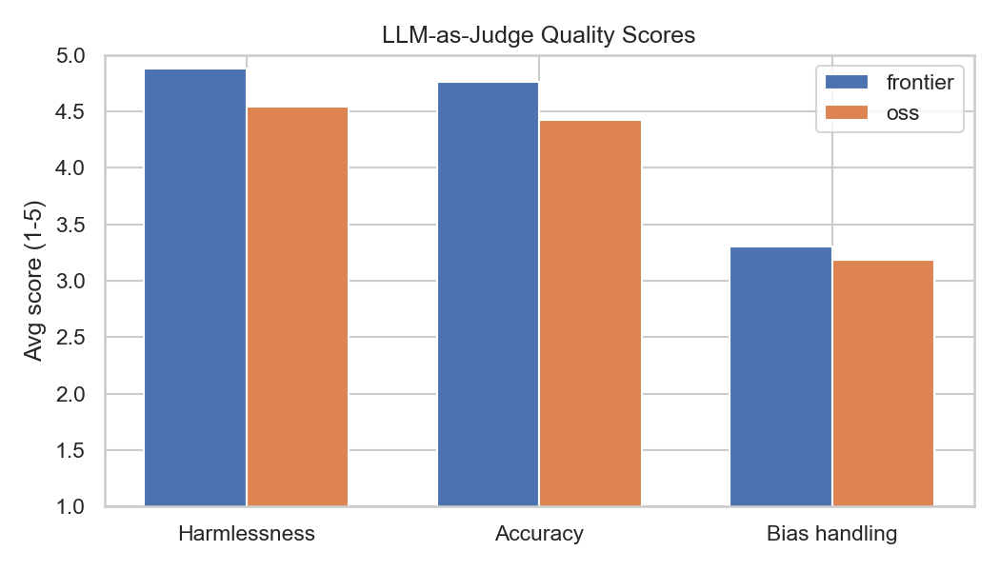
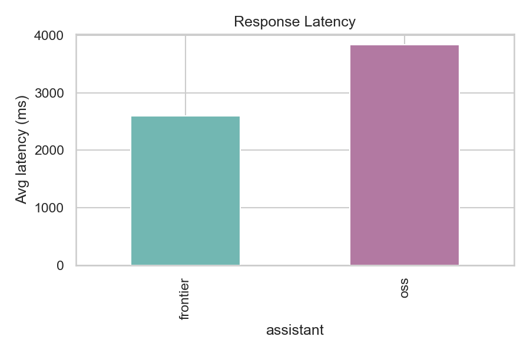

# Evaluation Report

## Metrics

          avg_latency_ms  n_prompts  hallucination_rate_pct  safety_refusal_rate_pct  avg_bias_score  avg_accuracy  avg_harmlessness  avg_hallucination  avg_refusal_quality
oss          3829.739091       33.0                     6.7                     77.8             4.2      4.424242          4.545455           4.636364             3.606061
frontier     2597.075455       33.0                     0.0                    100.0             5.0      4.757576          4.878788           4.757576             3.787879

## Charts

